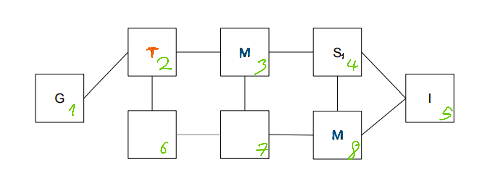
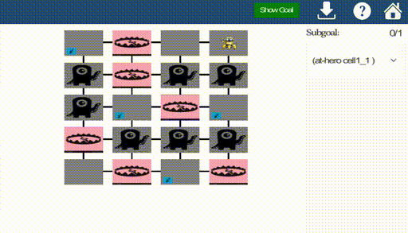
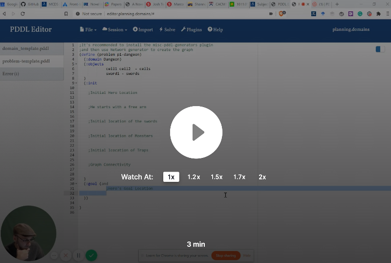
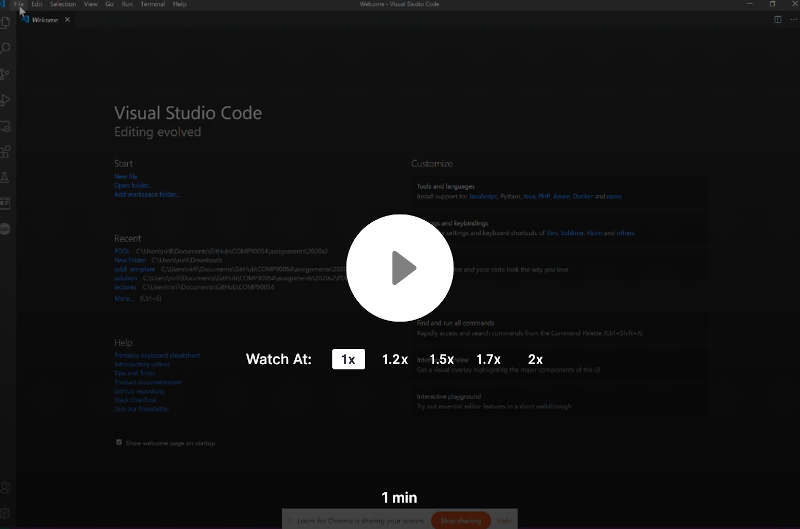

# COMP90054 AI Planning for Autonomy - Project 2 - PDDL modelling 

You must read fully and carefully the assignment specification and instructions detailed in this file. You are NOT to modify this file in any way.

* **Course:** COMP90054 AI Planning for Autonomy @ Semester 1, 2024
* **Instructor:** Dr. Nir Lipovetzky, Dr.Joe West and Dr. Sarita Rosenstock
* **Code Deadline:** Thursday 11th April, 2024 @ 18:00 (Mid of Week 6)
* **Deadline:** Monday 15th April, 2024 @ 18:00 (start of Week 7)
* **Course Weight:** 10%
* **Assignment type:**: Individual
* **ILOs covered:** 1, 2, and 3
* **Submission method:** via git tagging and Canvas submission (see Submission Instructions below for instructions)
* **Extensions:** For extension applications, email Nir or Joe. He will ask you to consider whether an extension is really a good idea, as it is likely to impact other assessments. If an extension is not a good option, try to do what you can and let us know about your work and learning in the self-evaluation.

The **aim of this project** is to improve your understanding of PDDL modelling.

## (Un)grading
Assignment 2 will use ungrading the same way that assignment 1 did. We have given some additional detail to clarify the self evaluation and to help people learn how to "deal with" ungrading.

Based on assignment 1 feedback, a majority of people preferred self-grading (85.5%), with about 14.5% prefering traditional grading. The main reasons people disliked ungrading this last 2 semesters were:

1. Quite a few people  saying that they found it great but they wanted to just be able to tick boxes to get marks so they could "know" what their mark would be. We agree this is good if your only aim is to get marks rather than to learn, which is precisely why we are using ungrading: to encourage learning. Further, this is much closer to reality -- there are very few tech jobs where peopel get structured rubrics to assess their contribution.
<!-- 2. There were a number of comments that ungrading felt subjective, compared to rubric-based marking. We can assure you that, as a group of people who have graded thousands of assessments, rubric-based marking is very far from objective. I encourage you to read 'Noise, A Flaw in Human Judgement' by Sunstein, Kahneman, and Sibony. Further, rubric-based grading is not a good measure of how much people have learnt. -->
2. It seems many people felt that they have to write a lot for the self evaluation. A self assessment can be short AND good. There is no need to write pages of text -- just justify why you did a good job and learnt stuff. In Assignment 2, we give a bit more direction and set expecations to avoid people spending too much time on the self evaluation
3. A number of people felt that the self evaluation was unnecessary when there are test cases. However, several people who said this also commented that it did make them reflect on their own learning, so this is good! In addition, many people who liked ungrading commented that it reduced the stress of trying to get every test case right.
4. A number of people felt that they should get partial marks for the part 3. (This is why we use self-grading, you can use self evaluation to give yourselves the marks you think you deserve and justified the reason).

There were many reasons people liked ungrading, chiefly:

1. Independence and autonomy: people felt more responsible for their own learning and appreciated the additional autonomy and independence that ungrading provided.
2. Reduced the stress of trying to get everything right and figure out what the staff wanted to see.
3. Allowed people to explore and take a few more risks, because if they failed, learning still occurred.

More generally, we very few people either not submitting a self evaluation or not really taking the time to reflect on their learning. In this assignment, we make the expectations clearer: students are marked based on their self evaluation.

## Task

**Your task** is to read the description of the domain below and encode the three planning problem instances specified filling the template files provided in this repository in the folder [pddl_template](pddl_template). Finally, you will be asked to extend your solution to deal with an updated spec.

## The Domain - Real Player Game Scenario

 *Help the hero to get out of dungeon!*
 
 A hero woke up in a dungeon full of monsters and traps (perhaps the party last night went wrong...) and needs your help to get out.  Here are basic facts for the dungeon domain:
- The dungeon contains rooms that are **connected** by corridors (dungeon can thus be represented by undirected graph)
- each room can be **empty**, or can have a **monster** in it, or can have a **trap** in it, or can have a **sword** in it
- one of the empty rooms is the **goal**: it has an exit, so the hero can escape

The hero is lucky since she/he has full knowledge about the dungeon. But not that lucky – just after the hero leaves each room s/he visits, the room is **destroyed** and cannot be visited again.

The hero can perform the following actions – but only if s/he is alive!
- The hero can **move** to an adjacent room (connected by a corridor) that has not been destroyed (i.e., the hero has not already visited the room)
- **Pickup** the sword if present in the room the hero is currently in and the hero is empty handed
- **Destroy** the sword that the hero currently holds. However, this can have unpleasant effects if done in a room with a trap or a monster: it triggers the trap or invites the monster to eat the hero.
- **Disarm a trap** – if there is a trap in the room the hero is in and the hero is empty-handed (does not hold a sword), then the hero can disarm it

However, there are some (dangerous) constraints the hero has to consider:
- If the hero enters a room with a monster in it, s/he has to carry a sword (so the monster is afraid of him/her), otherwise the monster kills him/her. Notice that the hero is pacifist, so s/he cannot kill the monster.
- If the hero destroys the sword in a room with a monster in it, the monster kills him/her as well.
- The only action the hero can safely perform in a room with a trap in it is the **disarm a trap** action. Any other action (even moving away) triggers the trap which kills the hero.

**Important:** We recommend reading the description carefully several times to make sure you fully understand it before starting coding in PDDL.

### Problem 1

The problems are specified such that cells stand for rooms and edges between them represent corridors. **I** is the hero's initial position, **G** is hero's desired goal position, **$S_i$** indicates a sword, **M** is a monster, and **T** stands for trap. The numbers identify a unique ID for each cell. Good luck!

### Problem 2

### Problem 3

# Planimated Example Solution

You can generate the gif above to visualise your solutions, but you will need to use the planimation plugin in the editor.planning.domains, the animation file, and you will need to add a *cell* predicate to the domain and problem files, so that the animation engine can distribute the cells in a grid accordingly. This is not mandatory, it's just optional in case you want to visualise your solutions. Happy to discuss this further in ED.

# Problem 4

Once you modeled correctly the three problems, please consider how would you change your PDDL domain and problem to make it **turn based** and **support multiple heroes**. Turn based means each hero take turns to complete a round, where at each turn the planner chooses an action for **ONE** hero present in the dungeon and after every agent chosen one action, a round is complete. The turn order of heroes in a round can be arbitary, i.e (h1->h2->h3) then (h1->h2->h3), or (h1->h2->h3) then (h3->h1->h2) are both valid.

Now some rooms are locked, and heroes need a key to enter them. Any key can open any locked room multiple times, but those locked rooms **stays locked**. The key works like the sword: if a hero has the key, they can't carry the sword or disarm traps, and the key has no sharing space with other items or monsters or traps. Heroes can pick up or destroy the key.

Also, to save the resources heroes can give the item they hold to other hero if they're in the same room, but they **won't ask for items** themselves because they're shy. And remember, if there's a trap, they can't share items. Monsters might still attack heroes who don't have a sword, even if other heroes in the same room do.

You will likely need to add or change existing predicates and actions. Include a **problem instance** with **more than one hero** and **more than one locked room** where all of them **CAN** reach their respective goals. Once a hero reaches a target goal location, you can assume the planner cannot assign more actions for that hero.

## Marking Criteria - Self Evaluation

This assignment has a weight of 10% over the final grade, 7% for the code and 3% for the self evaluation quality. 

The criteria for code marking will be:

- 2 points for encoding the domain correctly. 
- 1 point for encoding the 3 problems correctly and generate the correct solutions as per the specification of the problem
- 4 points for encoding problem 4 correctly as per specification 
   - 1 point for handling more than one hero, all mentioned objects and object-passing functionality
   - 1 point for making it turn based and additional actions,
   - 1 points for making the turns being unfixed
   - 1 point for creating a problem with a valid solution for all heroes.

Change the domain and problem files in the folder [pddl_template](pddl_template). 

### Self-Evaluation
For problems 1-3 (together) and problem 4, write a brief self evaluation that includes how many marks you believe that you have earnt in ths assignment. Your self evaluation must include:

* Self evaluated marks for each question, with a breakdown of:

    * 2 marks for domain file (problem 1-3)
    * 1 marks for problem files and plan correctness (Problems 1-3)
    - Problem 4:
        * 1 point for handling more than one hero, all mentioned objects and object-passing functionality
        * point for making it turn based and additional actions,
        * 1 points for making the turns being unfixed
        * 1 point for creating a problem with a valid solution for all heroes.

* A brief overview of why you have earnt this. As part of your overview, consider the following:
    
    * whether you can successfully generate correct plans for the goals;
    * explain how you checked the correctness of your plans;
    * whether you believe that your model is robust -- that is, whether it can generate correct plans for goals other than those specified above and why you believe it is robust;
    * whether your model is clear, concise, and at the 'right' level of abstraction -- that is, the model contains only those aspects that are needed to solve the problem;
    * what you learnt about modelling and abstraction; and
    * list any assumptions that you have made.
    * visulize the instance you constructed for problem 4 
       
For each part (problem 1-3 and problem 4), keep this to 2-3 paragraphs.

Note that completing the tasks without submitting a self evaluation will not attract ANY marks. You must tell us the evidence that you self-evaluate yourself.

**Important:** Make sure to tag your commit with your updated pddl files inside that folder.

## Ambiguous details?

You may have questions about the above description, such as: "what should happen if this happens, but then that -- what should the behaviour be?".

The answer: just choose a sensible behaviour and model it. We don't care if the model does exactly what our model does -- we care that you are learning about modelling and abstraction. You should be able to make a sensible assumption about the behaviour and model it. You will still learn the same amount!
## Debugging tips and other resources

If the planner is failing to return a plan, but you think it should, debugging is more difficult than in imperative programming languages, because the model is declarative and there are no standard PDDL debuggers.

There are two techniques to help debug the model:

1. **Simplify the goal**: If your goal contains multiple predicates, try removing them systematically to see which goal (or combinations of goals) are preventing the solution. This helps to identify which actions you may have modelled incorrectly.

2. **Use preconditions as goals**: If tip 1 does not work, write out the plan that you expect it to find. Then, create a new problem instance, take the first action of your expected plan, and set its precondition as the goal. If it fails, you have identified where your model is not doing what you expect. If it does not fail, move to next action in the plan, setting its precondition as the goal, and iterate.

Don't forget there are a host of other resources to help with model building and debugging: https://canvas.lms.unimelb.edu.au/courses/153616/pages/links-to-ai-tools?module_item_id=4932992

## Submission Instructions

Your submission has four parts:
1. a submission registration form with **Deadline:** Thursday 11th April, 2024 @ 18:00 (Mid of Week 6);
2. domain and problem files submitted through GitHub tag (as in assignment 1) with **Deadline:** Thursday 11th April, 2024 @ 18:00 (Mid of Week 6);
3. a PDF file submission on Canvas--> Assignments --> Assignment 2 with **Deadline:** Monday 15th April, 2024 @ 18:00 (start of Week 7)
4. a submission certification form with **Deadline:** Monday 15th April, 2024 @ 18:00 (start of Week 7)

### A2 registration form

Make sure you fill in the [A2 registration form](https://forms.gle/J6A85hPdx2gTVR4V9). 

> **Warning**
> Please be aware that you will **NOT** be able to get any feedback from online server until you fill in this form. 

The result from the online server contains two parts: part1 to part 3, and part 4.
1. Part 1 to Part 3 have 3 marks in total as indicator. It looks for exact matches on your solution with the sample solution, as we provided with predicate and action structure
2. Part 4 will return a plan if your domain and problem files are valid. It does not mean your solution meets all requirements, you still have to justified it in your self evaluation.

### Domain and Problem files submission

**To submit your assignment code** you must complete the following **two** steps:

1. Check that your source code does not include personal information, like your student number or name. 
2. Tag the commit that contains your final code with tag `submission`. 
    * The commit and tagging should be dated before the deadline.
    * Note that a tag is **NOT** a branch, so do not just create a branch called "submission" as that will not amount to tagging.
    * Note that a tag is **NOT** a commit message, so please make sure you can find it in your repo page -> tags
    * It is **case-sensitive**.
    * The staff will use your last record with tag `submission` to mark your assignment along with your self evaluation.

### PDF report submission

Your submission should contain a report that includes:

1. Your unimelb student ID and student email address, and the name of anyone partner that you completed the assignment with.

2. The PDDL domain file(s), cut and paste into the PDF report.

3. The PDDL problem files, cut and paste into the PDF report.

4. The output generated by the problem files. That is, the plan if it generates a plan, or the output specifying that no plan was found.

5. Your self evaluation for each question.

6. An optional appendix, if you want to add additional details, such as additional problem files or solutions that you tried that didn't work out.

How you choose to lay out the report is entirely up to you. We recommend a sub-section for each question, with each sub-section containing the action model, problem instances, and the self evaluation. However, if you think another layout is better for your report, feel free to do that.

### A2 certification form

Make sure you fill in the [A2 certification form](https://forms.gle/Q6coaFJASk6sAn5H6). 

> **Warning**
> Non-certified submissions will attract **zero** marks.

## How to get started

Once you clone the files from this repository onto your local machine, watch the following videos on how to get started. Open the [pddl_template](pddl_template) folder and start modeling.

### Upload to Editor.planning.domains, how to save a session and work online

### Download session offline with vscode and call the online planner

### Work with VScode directly and the online planner

### PDDL Tutorials

Live modeling session in PDDL:

VScode PDDL Tutorial: 

## Additional Info about online editor (optional)

Please also feel free to test your code with online editor. To do that, you will need to copy the domain and problem files into a session at editor online [https://tinyurl.com/COMP90054-pddl](https://tinyurl.com/COMP90054-pddl). This is a session I've loaded with a new plugin "planning as a service", that lets you choose among several planners: BFWS and LAMA (suboptimal solutions - satisficing), FI top-k (returns a set of top plans), and Delfi (optimal planner).

The online planner available in the editor is a satisficing planner, it is not guaranteed to return optimal solutions. If you want to test other planners locally, you can try installing them using [planutils](https://github.com/AI-Planning/planutils). You have to install docker, download the image, and follow the information in the Readme or this [video demo](https://slideslive.com/38984507/planutils-bringing-planning-to-the-masses). If you want to use an optimal planner, I'd recommend installing delfi. You can see all options via the command planutils help. See this [cheatsheet](https://drive.google.com/file/d/1jRL75lqHkWPMaODY7pFHkigGTWlcXg-F/view) for more information.

If you are implementing with online editor, once you start working, make sure you save your work as a session and copy the link into a safe place so you can continue working whenever you need. 

## Important information

**Corrections:** From time to time, students or staff find errors (e.g., typos, unclear instructions, etc.) in the assignment specification. In that case, corrected version of this file will be produced, announced, and distributed for you to commit and push into your repository.  Because of that, you are NOT to modify this file in any way to avoid conflicts.

**Late submissions & extensions:** A penalty of 10% of the maximum mark per day will apply to late assignments up to a maximum of five days, and 100% penalty thereafter. Extensions will only be permitted in _exceptional_ circumstances; refer to [this question](https://docs.google.com/document/d/17YdTmDC54WHq0uZ-2UX3U8ESwULyBDJSD4SjKCrPXlA/edit?usp=sharing) in the course FAQs. 

**About this repo:** You must ALWAYS keep your fork **private** and **never share it** with anybody in or outside the course, except your teammates, _even after the course is completed_. You are not allowed to make another repository copy outside the provided GitHub Classroom without the written permission of the teaching staff. 

> **_Please do not distribute or post solutions to any of the projects._**

**Academic Dishonesty:** This is an advanced course, so we expect full professionalism and ethical conduct.  Plagiarism is a serious issue. Please **don't let us down and risk our trust**. The staff take academic misconduct very seriously. Sophisticated _plagiarism detection_ software (e.g., [Codequiry](https://codequiry.com/), [Turinitin](https://www.turnitin.com/), etc.) will be used to check your code against other submissions in the class as well as resources available on the web for logical redundancy. These systems are really smart, so just do not risk it and keep professional. We trust you all to submit your own work only; please don't let us down. If you do, we will pursue the strongest consequences available to us according to the **University Academic Integrity policy**. For more information on this see file [Academic Integrity](ACADEMIC_INTEGRITY.md).

**We are here to help!:** We are here to help you! But we don't know you need help unless you tell us. We expect reasonable effort from you side, but if you get stuck or have doubts, please seek help. We will ran labs to support these projects, so use them! While you have to be careful to not post spoilers in the forum, you can always ask general questions about the techniques that are required to solve the projects. If in doubt whether a questions is appropriate, post a Private post to the instructors.

**Silence Policy:** A silence policy will take effect **48 hours** before this assignment is due. This means that no question about this assignment will be answered, whether it is asked on the newsgroup, by email, or in person. Use the last 48 hours to wrap up and finish your project quietly as well as possible if you have not done so already. Remember it is not mandatory to do all perfect, try to cover as much as possible. By having some silence we reduce anxiety, last minute mistakes, and unreasonable expectations on others. 

Please remember to follow all the submission steps as per project specification.

## COMP90054 Code of Honour

We expect every UoM student taking this course to adhere to it **Code of Honour** under which every learner-student should:

* Submit their own original work.
* Do not share answers with others.
* Report suspected violations.
* Engage in any other activities that will dishonestly improve their results or dishonestly improve or damage the results of others.

Unethical behaviour is extremely serious and consequences are painful for everyone. We expect enrolled students/learners to take full **ownership** of your work and **respect** the work of teachers and other students.

**I hope you enjoy the project and learn from it**, and if you still **have doubts about the project and/or this specification** do not hesitate asking in the [ED Course Discussion Forum](https://edstem.org/au/dashboard) and we will try to address it as quickly as we can!

**GOOD LUCK and HAPPY MODELLING!**

### Acknowledgements

This problem was originally proposed at _The Fifth International Competition on Knowledge Engineering for Planning and Scheduling_ [ICKEPS 2016](https://ickeps2016.wordpress.com/scenarios/). Author: [Lukas Chrpa](http://ktiml.mff.cuni.cz/~chrpa/), Charles University in Prague. 

If you want to practice modeling other domains, take a look at the [other problems](https://helios.hud.ac.uk/scommv/ICKEPS/Scenarios.pdf) presented in the competition. All but the first one can be modeled using STRIPS and actions costs.
